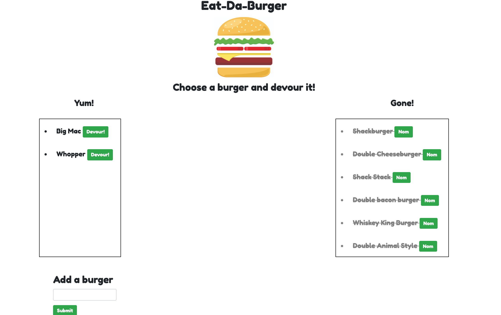

# Eat-Da-Burger 

## About

Eat-Da-Burger is a full-stack application that allows users to submit a burger of their choice, or choose an existing burger, and "devour" it. Node and MySQL query and route the data from the "burgers" database on the back-end, while Handlebars generates the HTML on the front-end. The application is deployed to Heroku.  

## Technologies Used

- CSS (w/Bootstrap framework)
- JavaScript
- jQuery 
- Node.js
- Express.js 
- Handlebars
- MySQL 
- Heroku 

## How to Use It

Check out the live site [here](https://sheltered-lake-63827.herokuapp.com/). 

Click the "Devour" button next to an appetizing burger in the "Yum!" table, or submit a new burger using the form at the bottom of the page. Once the burger has been devoured, it will appear crossed out in the "Gone!" table. 

